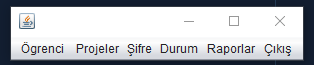

# stajyer-takip-sistemi
Java programlama dili ile yapılan stajyer takip sistemi
---

Java programlama dili ile yazılmış bir stajyer takip sistemidir.

--> Kullanıcı ilk olarak giriş yapması gerekmektedir.

-->Giriş yapan kullanıcıya öğrenci, proje şifre,durum,rapor ve çıkış olarak 6 seçenek sunulmaktadır.

-->Kullanıcı yeni öğrenci ekleyebilir, düzenleyebilir, öğrencinin staj bilgilerini düzenleyebilir, öğrenciye proje ekleyebilir.

--> Yeni proje ekleyebilir,silebilir ve düzenleyebiilir.

--> Kullanıcı sisteme yeni kullanıcı ekleyebilir

-->Kullanıcı stahyerlerin gelip gelmediğini kontrol edebilir ve devam kontrolü yapabilir.

-->Öğrenciye ait istediği tüm bilgileri raporlayabilr.

